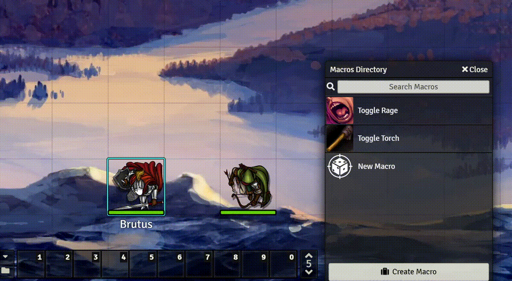
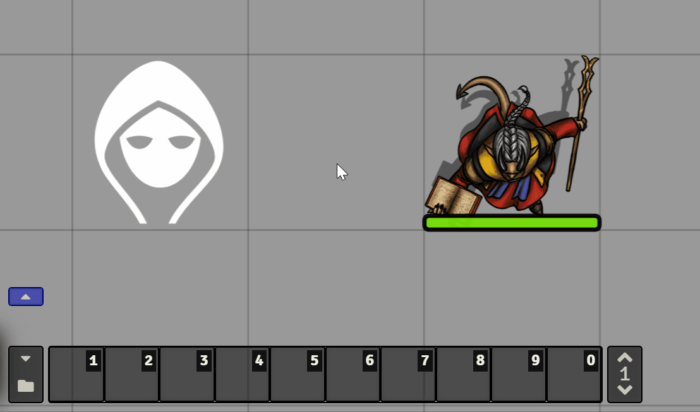
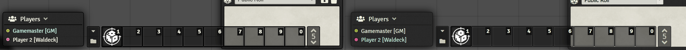
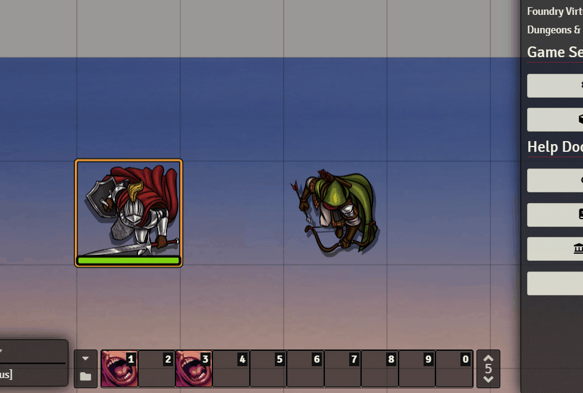
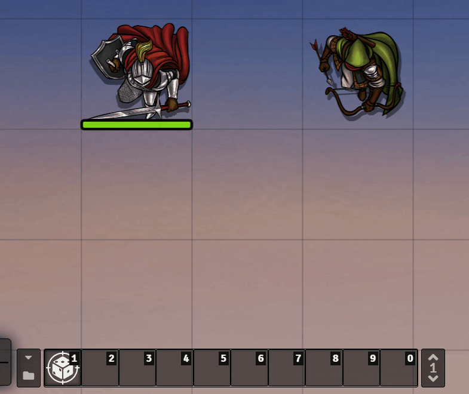

<h1 align="center">Token Hotbar</h1>
<p align="center">
 
</p>

Using this Foundry VTT module, you can assign one of the hotbar pages to remember macros per token.
If the token is linked to an actor, the hotbar will be associated with the actor.

## Features

### Dynamically change the hotbar
Based on your settings, one page of the macro hotbar will be used to dynamically change the macros based on your selected token.

<p align="center">

</p>

### Use an additional hotbar
Token Hotbar integrates with Norc's [Custom Hotbar](https://foundryvtt.com/packages/custom-hotbar/), keeping the original 5 hotbar pages free and giving you a dedicated Token Hotbar.

<p align="center">

</p>

### Shared Token Hotbar
The token hotbar can be shared between players. Example: as the player on the right makes a change, the hotbar of the player on the left gets reloaded.

<p align="center">

</p>

### Lock Shared Hotbar
The shared hotbar can also be locked, so that only the GMs can edit it.

<p align="center">

</p>

### Automatically switch hotbar pages
When selecting a token with macros on its hotbar, it will automatically switch to the right page. When deselecting, it will switch back to the previous page you were on.

<p align="center">

</p>

### Settings
* **Page:** the hotbar page to use as token hotbar.
* **Link to actor:** link the token hotbar to the linked actor, such that for each linked token of this actor, the same token hotbar will be displayed.
* **Always link to actor:** link the hotbar to the actor, even if the token itself is not linked.
* **Share the hotbar with other players:** every player will see the same hotbar for the particular token.
* **Locked shared hotbar:** only GMs can modify hotbars (requires the above setting).
* **Use Custom Hotbar:** Use the additional hotbar provided by Norc's Custom Hotbar module.
* **Debug Mode:** Show detailed messages in the console (F12).

## Available Languages
* 🇨🇳 中文（简体）
* 🇩🇪 Deutsch
* 🇬🇧 English
* 🇪🇸 Español
* 🇫🇷 Français
* 🇯🇵 日本語
* 🇰🇷 한국어
* 🇳🇱 Nederlands
* 🇵🇱 Polski
* 🇧🇷 Português (Brazil)
* 🇷🇴 Română

## Contributing
Feel free to test out the latest beta using the following manifest link:
```
https://fvtt.janssen.io/tokenhotbar/beta/module.json
```

___

If you wish to help out with development, then clone the repo and start digging in!  
Unit tests are much appreciated. :)

