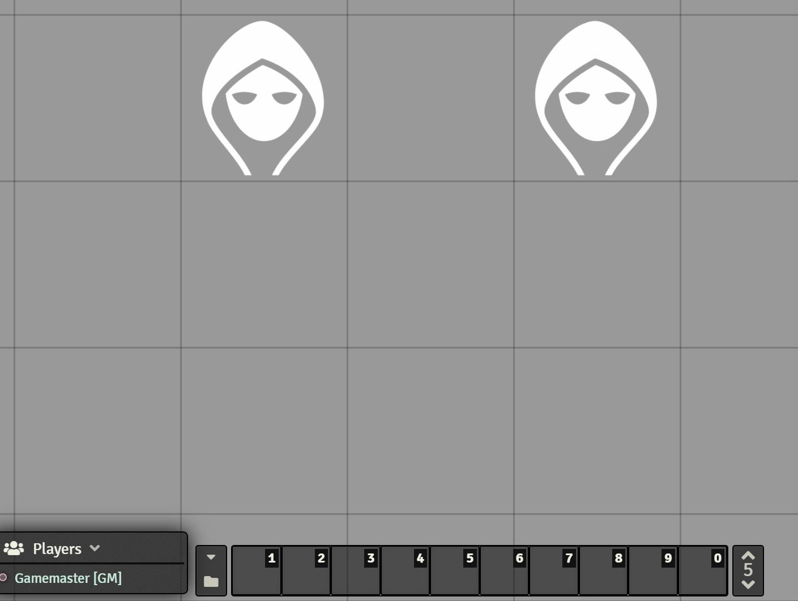

# Token Hotbar
Using this Foundry VTT module, you can assign one of the hotbar pages to remember macros per token.

## Installation
Install module and enter this url: https://raw.githubusercontent.com/janssen-io/foundry-token-hotbar/master/module.json

## Usage
1. Set your desired page in the module settings (default: 5)
2. Select a single token
3. Assign/remove some macros

